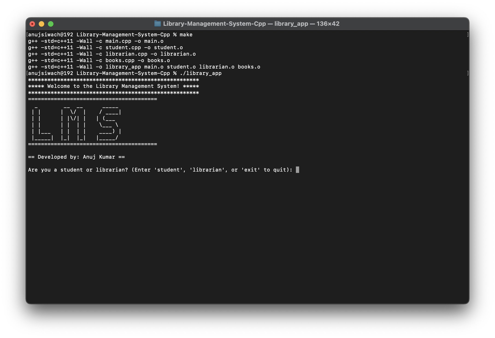
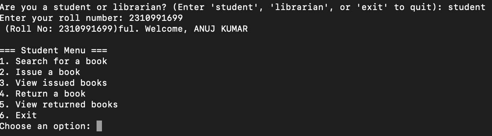
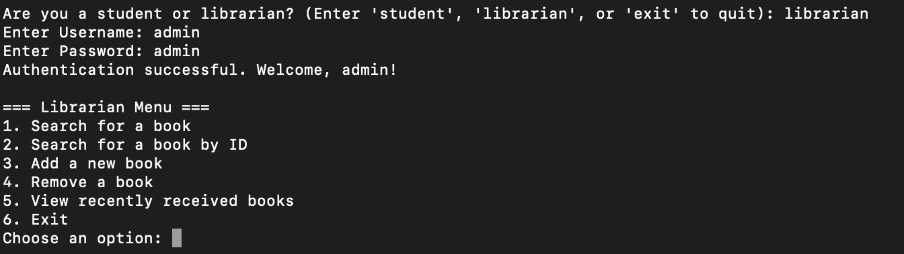

# 📚 Library Management System

Welcome to the **Library Management System**! This console-based application is designed to streamline the management of books in a library. It offers a user-friendly interface for librarians and students, enabling efficient handling of a large collection of books with functionalities such as adding new books, viewing available books, tracking their availability, and managing student records. The system uses a CSV file to store data, allowing it to handle a database of up to **100,000 books**.

## 🚀 Features

- **Add New Books**: 
  - Librarians can add details for new books, including title, author, publisher, price, year, and availability.
  - The system automatically updates the CSV file to reflect the newly added books.

- **View Books**: 
  - Fetch and display the list of all available books in a structured format.
  - Easily filter or search for specific books based on various attributes.

- **Track Availability**: 
  - Mark books as available or unavailable for issue.
  - Keep track of books that are currently issued to students.

- **Manage Student Records**: 
  - Add and view student information, allowing for easy tracking of which student has issued which book.

- **User-Friendly Command-Line Interface**: 
  - Simple and intuitive CLI that guides users through various operations.
  - Error handling and validation to ensure data integrity.

## 📸 Screenshots

Here’s a glimpse of the system in action:

- **Main Interface**:  
  

- **Student Interface**:  
  

- **Librarian Interface**:  
  

## 🛠️ Installation

### 1. Clone the Repository:

```bash
git clone https://github.com/Anuj-er/Library-Management-System-Cpp.git
```

### 2. Navigate to the Project Directory:

```bash
cd Library-Management-System-Cpp
```

### 3. Compile and Run:

Ensure you have a C++ compiler installed. Then compile and run the program:

```bash
make clean
make
./library_app
```

## 📂 Project Structure

```bash
.
├── README.md                           # Project documentation
├── all_headers.h                       # Contains struct and class definitions
├── books.cpp                           # Book management functionality
├── Librarian.cpp                       # Librarian functionalities
├── student.cpp                         # Student functionalities
├── main.cpp                            # Main entry point for the application
├── ./DATA/BooksDatasetCleanAnuj.csv    # Dataset of books (100K records)
├── ./DATA/G19-students-list.csv        # Student list for authentication
├── ./project-report/images             # Screenshots directory
```

## 📝 Usage

### Adding a New Book:

1. Run the program and choose the **Add Book** option.
2. Enter the book details:
   - Title
   - Author
   - Publisher
   - Price
   - Year of Publication
   - Availability status (Y/N)
3. The system will save the new book entry to `BooksDatasetCleanAnuj.csv`.

### Viewing Available Books:

1. Select the **View Books** option from the main menu.
2. The system will read from the `BooksDatasetCleanAnuj.csv` file and display a list of available books, including their details and availability status.

### Managing Student Records:

1. Use the **Manage Students** option to add or view student information.
2. Record details such as student name and roll number for easy tracking of issued books.

## 📜 Documentation

For further technical details, refer to:

- [C++ Documentation](https://cplusplus.com/)
- CSV File Handling for managing book and student data.

## 🔗 Links

- **GitHub Repository**: [Library Management System](https://github.com/Anuj-er/Library-Management-System-Cpp)
- **C++ Documentation**: [cplusplus.com](https://cplusplus.com/)
- **CSV File Handling Guide**: [CSV Reading and Writing](https://www.geeksforgeeks.org/csv-file-handling-c/)

## 💻 Contributing

Contributions are welcome! To contribute:

1. Fork this repository.
2. Create a new branch: `git checkout -b feature-branch`.
3. Make your changes.
4. Commit your changes: `git commit -m 'Add some feature'`.
5. Push to the branch: `git push origin feature-branch`.
6. Open a pull request.

### Guidelines for Contributions:

- Ensure code is well-documented and follows the existing style.
- Add unit tests for any new features or functionalities.
- Update the README.md file if necessary.

## 📧 Contact

For any questions, suggestions, or feedback, please reach out to: **Anujsiwachjaat@icloud.com**.
```
